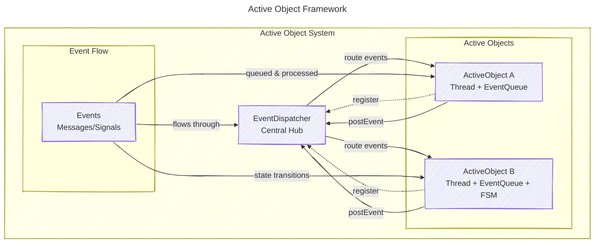

## Introduction - Why Concurrency Still Hurts 

Concurrency is one of those engineering challenges that never really gets easier.
Whether you’re working on an embedded control system, a robotics platform, or a communication stack, managing shared resources and timing constraints can quickly become tangled.

Real-time frameworks emerged to bring structure to this chaos — and at their core lies a concept called the Active Object.

## The Problem: Threads, Queues, and Shared State

Classic real-time systems often rely on raw threads, semaphores, and queues.
Each thread handles part of the system, but shared data introduces race conditions, blocking, and nondeterministic behavior.

As systems grow, this leads to fragile designs and unpredictable timing - exactly what real-time software must avoid.

# What is an Active Object?

The Active Object is a software component that combines its own thread of control with an event queue and a state machine.

Instead of multiple threads sharing data, each Active Object runs independently, reacting to events posted to its queue.

This model isolates concurrency within objects — events are the only way they interact.

Think of an Active Object as a small worker with its own inbox.
It only processes one message at a time, making decisions based on its internal state.
The result: no race conditions, no global locks, and much more predictable timing.

## How Active Objects Fit into a Real-Time Framework

A real-time framework built around Active Objects provides:
- An event-driven kernel (instead of raw threads)
- A run-to-completion execution model
- A priority-based scheduler for deterministic timing
- Hierarchical state machines to capture reactive behavior

Each component - motor controller, sensor manager, communication handler — can be implemented as an Active Object, improving modularity and traceability.

## Why This Approach Matters

- Predictability: Events are processed one at a time, ensuring deterministic response.
- Safety: No direct data sharing means fewer race conditions and simpler testing.
- Scalability: Systems can grow by adding more Active Objects, not by adding more shared complexity.
- Traceability: Each object’s behavior can be logged and analyzed independently.

## Resources
 - [Quantum Leaps - Active Object](https://www.state-machine.com/active-object)