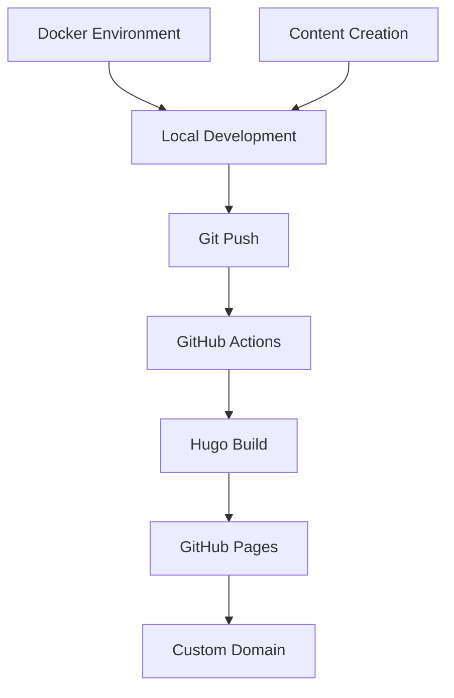

## Overview

This project implements a personal website using Hugo static site generator with automated deployment to GitHub Pages. The solution includes a containerized development environment and CI/CD pipeline for seamless content publishing.

## Technical Stack

- **Hugo Extended** - Go-based static site generator with SCSS support
- **PaperMod Theme** - Responsive theme with dark/light mode
- **GitHub Pages** - Static hosting with custom domain support
- **GitHub Actions** - CI/CD pipeline for automated builds
- **Docker** - Containerized development environment
- **Mermaid.js** - Technical diagram rendering with zoom/pan functionality

## Hugo Site Setup

### Prerequisites

```bash
# Install Hugo Extended (required for SCSS processing)
# macOS
brew install hugo

# Linux (Ubuntu/Debian)
sudo apt install hugo

# Windows
choco install hugo-extended
```

### Initial Site Creation

```bash
# Create new Hugo site
hugo new site my-website
cd my-website

# Add PaperMod theme as submodule
git submodule add https://github.com/adityatelange/hugo-PaperMod themes/PaperMod

# Initialize git repository
git init
echo "theme = 'PaperMod'" >> config.yml
```

### Configuration

Create `config.yml` with basic settings:

```yaml
baseURL: 'https://username.github.io'
languageCode: en-us
title: "Your Name"
theme: PaperMod

enableGitInfo: true
enableEmoji: true

markup:
  goldmark:
    renderer:
      unsafe: true
  highlight:
    style: github-dark
    lineNos: true

params:
  env: production
  title: "Your Name"
  description: "Your description"

  profileMode:
    enabled: true
    title: "Your Name"
    subtitle: "Your Title"
    buttons:
      - name: About
        url: /about
      - name: Projects
        url: /projects

menu:
  main:
    - identifier: home
      name: Home
      url: /
      weight: 10
    - identifier: projects
      name: Projects
      url: /projects/
      weight: 20
```

## Local Development Setup

### Docker Environment

Create `Dockerfile`:

```dockerfile
FROM hugomods/hugo:exts
WORKDIR /src
RUN git config --global --add safe.directory /src
COPY . /src
EXPOSE 1313
CMD ["hugo", "server", "--bind", "0.0.0.0", "--buildDrafts", "--buildFuture"]
```

Create `docker-compose.yml`:

```yaml
services:
  hugo:
    container_name: hugo-dev
    build: .
    ports:
      - "1313:1313"
    volumes:
      - .:/src
      - /src/node_modules
      - /src/public
      - /src/resources
    environment:
      - HUGO_REFRESH_TIME=1
      - HUGO_THEME=PaperMod
      - HUGO_BASEURL=http://localhost:1313/
    command: hugo server --bind 0.0.0.0 --buildDrafts --buildFuture
```

### Building and Testing Locally

```bash
# Start development server
docker-compose up --build
```

Visit: http://localhost:1313

### Content Creation

```bash
# Create new article
hugo new articles/my-post.md

# Create new project
hugo new projects/my-project.md
```

## GitHub Pages Deployment

### Repository Setup

1. Create repository named `username.github.io`
2. Enable GitHub Pages in repository settings
3. Set source to "GitHub Actions"

### GitHub Actions Workflow

Create `.github/workflows/deploy.yml`:

```yaml
name: Deploy Hugo site to Pages

on:
  push:
    branches: ["main"]
  workflow_dispatch:

permissions:
  contents: read
  pages: write
  id-token: write

concurrency:
  group: "pages"
  cancel-in-progress: false

defaults:
  run:
    shell: bash

jobs:
  build:
    runs-on: ubuntu-latest
    env:
      HUGO_VERSION: 0.128.0
    steps:
      - name: Install Hugo CLI
        run: |
          wget -O ${{ runner.temp }}/hugo.deb https://github.com/gohugoio/hugo/releases/download/v${HUGO_VERSION}/hugo_extended_${HUGO_VERSION}_linux-amd64.deb \
          && sudo dpkg -i ${{ runner.temp }}/hugo.deb

      - name: Checkout
        uses: actions/checkout@v4
        with:
          submodules: recursive

      - name: Setup Pages
        id: pages
        uses: actions/configure-pages@v5

      - name: Build with Hugo
        env:
          HUGO_ENVIRONMENT: production
          HUGO_ENV: production
        run: |
          hugo \
            --gc \
            --minify \
            --baseURL "${{ steps.pages.outputs.base_url }}/"

      - name: Upload artifact
        uses: actions/upload-pages-artifact@v3
        with:
          path: ./public

  deploy:
    environment:
      name: github-pages
      url: ${{ steps.deployment.outputs.page_url }}
    runs-on: ubuntu-latest
    needs: build
    steps:
      - name: Deploy to GitHub Pages
        id: deployment
        uses: actions/deploy-pages@v4
```

## Architecture



## References
- **[Hugo Documentation](https://gohugo.io/documentation/)** - Official Hugo docs
- **[PaperMod Theme](https://github.com/adityatelange/hugo-PaperMod)** - Theme repository